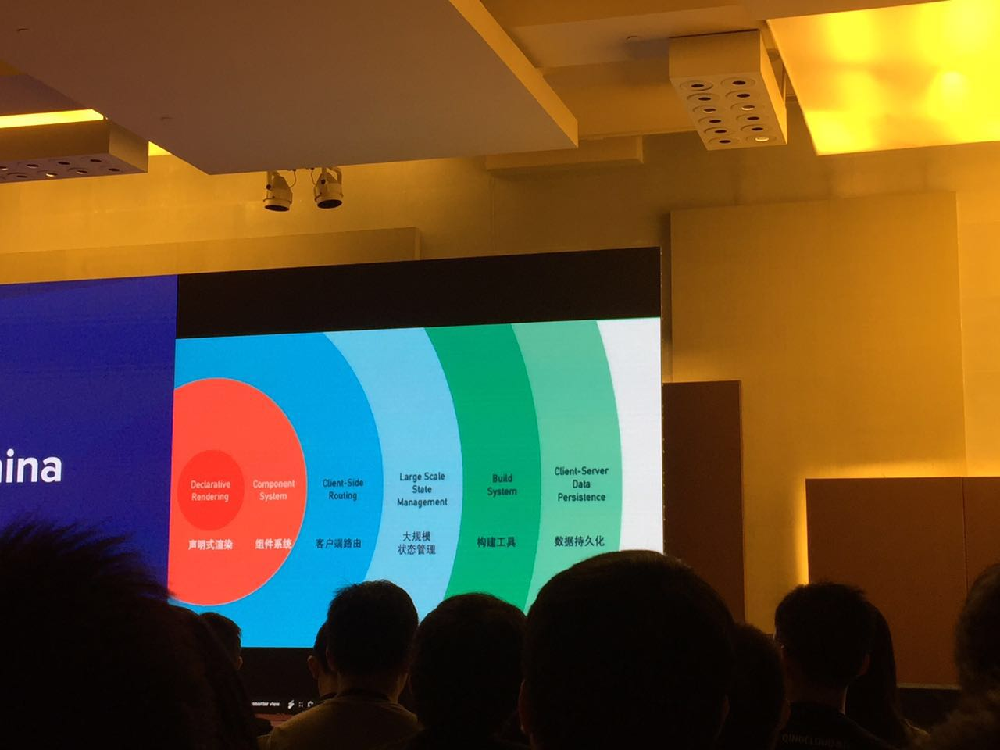
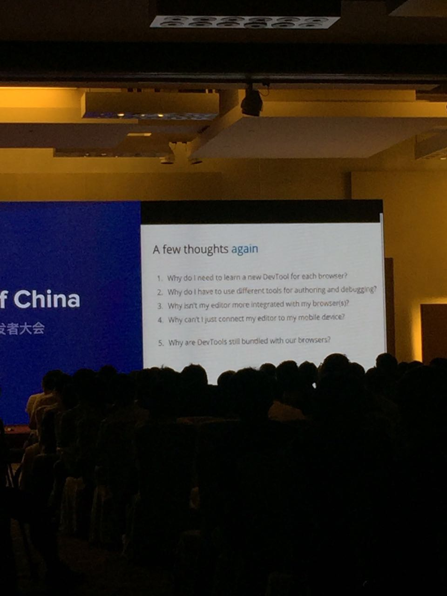
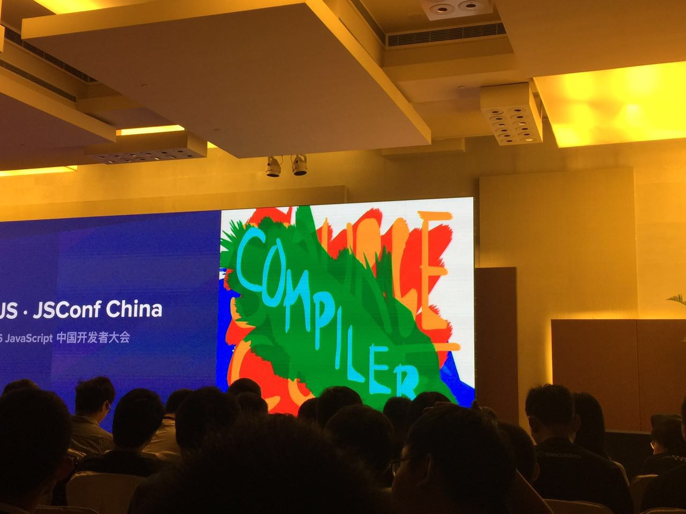
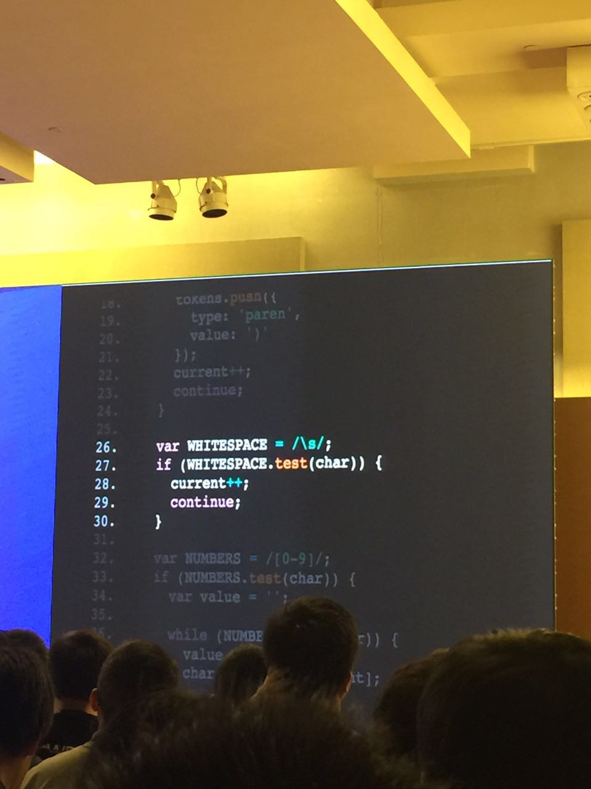
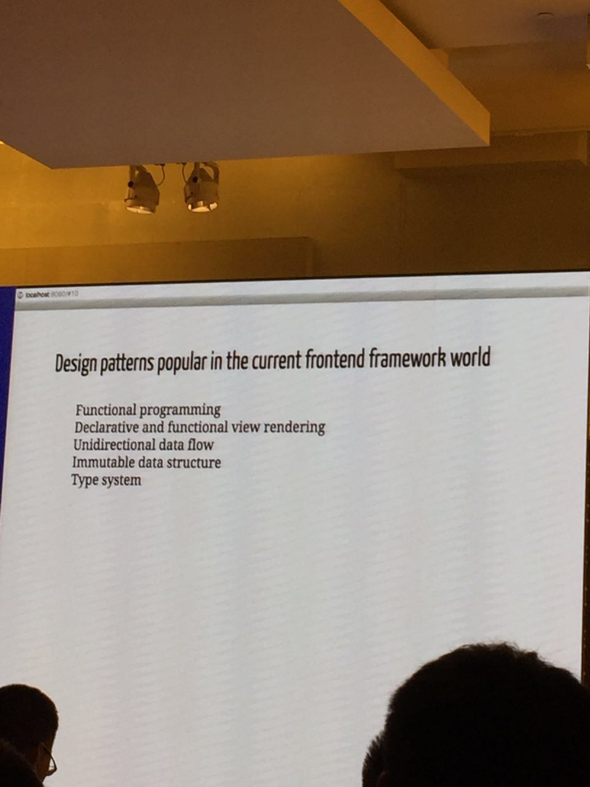
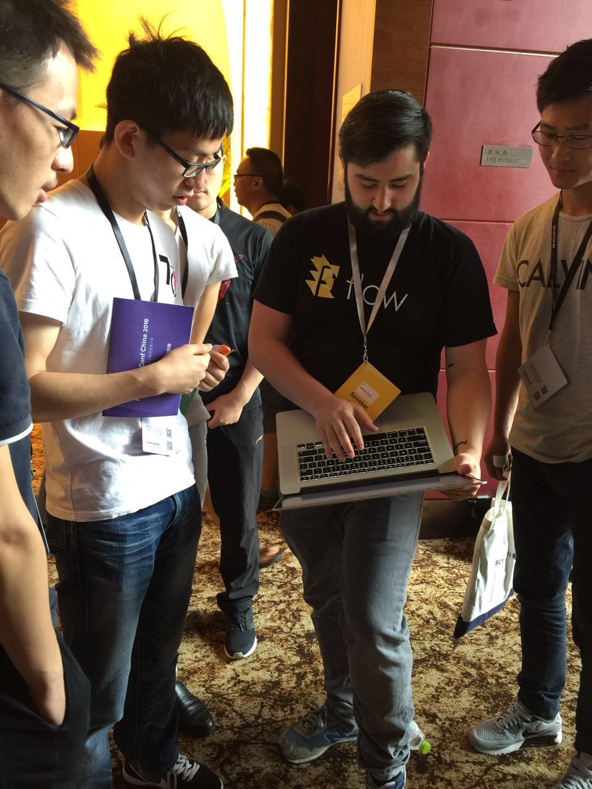

JSConf参会笔记
===============

## 前言
这次大会总共有20个topic（实际为19个，有个主题因为分享者无法到现场被临时取消了），以及额外的Lightning Talk环节，其中使用英语分享占到7场，QA环节也大量使用英文来提问和回答，所以英语很重要有木有。[知乎帖子传送门](https://www.zhihu.com/question/50244455)

## 花絮
1. 参会者中最小的有高中生了，自费的也占了挺大部分的。
2. Lightning Talk环节蛮有趣的
3. pm2的作者，现场直接开源了另外一个基于pm2的项目GridControl，掌声如雷啊👏👏👏
4. 有一个哥们介绍了自己的经历，这是第四次来参加JSConf, 然后从一个小菜鸟，一步步通过在Lightning Talk发言最后有机会上台分享一个完整的topic，挺励志的

## 主题
### 1、Vue.js the Past and the Future
**关键字**：`Vue2.0`  `The Progressive Framework（渐进式框架）`

没有在实际项目中使用过Vue.js, 所以并不是很熟悉，只能拿Angular或ReactJS来与之对比。听完尤大的介绍对Vue还是蛮敢兴趣的，比如它对前端更友好的模板，V2.0之后更快的速度以及更小的体积，蓬勃发展的社区。以后有中小项目还是很想试试手的。

ps: 犹大被安利到weex团队担任技术顾问了，后续可以更好的整合weex来挑战ReactJS + ReactNative

介绍点如下：

	* 一个框架能够解决的问题是很多的，所以定位很重要，Vue只关注`声明式渲染`和`组件系统`，见附图第一张
	* vue即将推出V2.0，faster and lightly，目前在完善文档，应该不用过多久就会推出
	* virtual DOM，这块跟React最大不同是更智能的渲染机制，提前生成了依赖树，不用一层层递归判断shouldComponentUpdate
	* 推荐优先使用Vue模板，实在较难实现的逻辑才使用Render Function来做
	* Server Side Rendering介绍
	* vue && veex
	* 如果你积极帮助回答issue，能够贡献PR，会有机会被加入到Vue的开发团队中去	
### 2、How to Build a Compiler
分享者是来自Facebook的[James Kyle](https://github.com/thejameskyle)，超有极客风范的, babel及flow的核心贡献者之一。主题是如何去构建一个编译器，并且现场直接演示代码，如何构建一个简单的编译器。最大感触是PPT怎么可以做的这么任性这么炫，“亮瞎了眼”的配色，代码介绍时超赞的效果，我真心不知道怎么做出来的（回去得好好研究下）。[编译器代码](https://github.com/thejameskyle/the-super-tiny-compiler/blob/master/super-tiny-compiler.js)

### 3、阿里node团队开源项目 企业级框架EGG
首先介绍了阿里内部的nodejs应用越来越多，基于nodejs的开发者也越来越多，怎么解决和已有的中间件系统对接，安全和监控等痛点，引出[EGG框架](https://eggjs.org/)

* 阿里内部孵化出来的一个开源项目
* 强调自动config、插件机制、安全插件
* 比较有用的是安全类的插件，有着阿里前后端对安全方面多年的积累和沉淀，我不清楚美团内是否有类似的框架和插件体系，如果有的话可以给业务线提供很好的支持。
* 跨语言RPC，nodejs 模仿了java 的rpc框架实现了序列号、反序列化、服务治理等
* 企业级日志系统
* 调试工具
* 提供性能分析功能

总结：声音太小，egg这个框架看起来是解决了很多问题和开发的痛点，但是都没有深入点的介绍，如果自己真的感兴趣还是需要慢慢去琢磨吧，这也是BAT等公司的尿性吧，都是一边来分享一边来打广告招人。有个感触，大公司都更注重把开发规范技术积累给工具化插件化了，这样能够把好的经验和解决方案积累沉淀下来，比如老生常谈的安全、代码检查、单元测试、内存泄露分析等等。

### 4、聊聊JS测试框架
严老师一上台就打广告了。。。[PPT传送门](https://github.com/zensh/slides/blob/gh-pages/2016test-framework/jsconf2016.pdf)

知识点：

* 介绍了mocha流和tape流
* jest,react御用测试框架
* 介绍自己的新轮子[T-man](https://github.com/thunks/tman)

### 5、GridControl: Networked PM2 for Microservices applications
**关键字**：`micro service`

* PM2 author
* originised application
* PM2 V2 will be released in September
* microservice is hot but hard
* [GridControl](https://github.com/gridcontrol/gridcontrol),network layout
* Service Discovery/ Distributed File System/ Distributed Messageing

### 6、3D on the Web
前面是webgl的简单介绍以及由此实现了一个demo，后面通过引入three.js来精简了大量的代码，提高了开发效率，引申出了使用three.js来进行web 3d开发，我觉得是蛮好的一种介绍方式的。因为大部分前端开发者其实在工作中蛮少能够接触到3D开发的，这方面也比较需要专业的知识，我觉得这类型的分享就是带领大家入门然后告诉大家这里面好玩炫酷的东西可多呢就挺好的了。[PPT传送门](http://www.shiyaluo.com/slidedecks/jsconf-china-2016/#/)

知识点：

* three.js的使用
* setTimeout和requestAnimationFrame的在浏览器中绘制动画的区别

总结：非常酷的3D效果，突然想起了一句话，如果说数学抽象了整个世界，物理学解释了整个世界，那么计算机科学模拟了整个世界

### 7、Build Virtual Reality on the web
**关键字**：`WebVR`

知识点：
* 传统VR和webVR的对比
* A-frame框架

### 8、Building a Unified Frontend and Mobile Team
**关键字**：`全端工程师`

知识点：

* react native技术带来的开发分工变革
* 

总结：爱写代码的CTO，使用新的模式来组建技术团队，给出了一些不错的建议，例如可以先从小项目小团队开始尝试，积累全端开发这种经验。

### 9、Building asynchronous microservices that get along
**关键字**：`micro service`

### 10、单页应用“联邦制”实践
1. 给出问题，一个单页应用中，不同模块如果要求有不同的灰度策略，你怎么处理？
2. 如何解决：根据angular设计了一套架构，可以运行多个版本共存，一个单页应用可以存在多个产品模块版本，多个公共模块版本
3. 单页应用体积变大之后，如何解决多个产品需要不同灰度，不同版本的问题

没听的很清楚所以也没记录的很清楚，而且感觉目前对我来说也并不实用，后续有碰到类似问题再来翻吧

### 11、前端DevOps实践
工具介绍：
* nodejs plugin
* jenkins pipeline

### 12、NodeJS在线性能调优和故障排查
3个问题分析和解决：
CPU cupprofile
在一个http请求中做一个加密算法

Memory leaks
在一个http请求中push一个对象

chrome dev tools
* 无法处理较大文件
* 评估不够准确，如果没有Constructor，无法找打对应的类

GC
solution: 
GC trace log, heaptimeline
node --trace_gc --trace_gc_verbose app.js
缺少GC的Demo

solution: 
V8-profiler/node-inspector

一堆广告，就是来推销阿里的node服务的嘛，有点失望啊朴灵大神。这里是[PPT和代码介绍地址](https://github.com/JacksonTian/jsconfcn2016)

### 13、Learning Design Patterns from Modern JS Frameworks
介绍的内容都是React社区也比较流行的一些设计，只是为啥扯到Design Patterns呢，难道是我对设计模式理解的太狭义了吗，一开始我确实有点懵逼了，Design Patterns跟OO、MVC这些并没有毛线关系的啊。后来匿名犀利哥也给吐槽了

Design patterns popular in the current frontend framework world: 
* Functional programming
* Declarative and functional view rendering
* Unidirectional data flow
* Immutable data structure
* Type system

知识点记录：

1. not pure function, hard to test，简而言之，就是方便来做测试
2. high order function
3. 用在view层，可以做到复用，你只要关心你传入的数据，就会给你返回一个view
4. js中没有type script的缺点，flow用来改善，react native中就使用到了

### 14、面向未来的自动化测试-Macaca
该项目已经开源了，这里是[github传送门](https://github.com/alibaba/macaca)。因为有PPT了，所以就没有记录多少笔记下来，[PPT传送门](https://xudafeng.github.io/slide/archives/ningjs/)。通过electron开发了一整套的测试套件？下午坐太靠后了听的不是很清晰，这个值得一撸啊，最近大象PC也正在使用electron来进行开发，有参与了项目还是有点了解这个技术。
### 15、Managing Async with RxJS 5 at Netflix
介绍了异步编程的坑，比如callback hell, 然后介绍promise cann't cancel，最后介绍了RxJS通过observable实现了各种异步的方法封装，并且提供了统一的方法给使用者调用,实现了自己的catch/cancel/,封装了ajax,socket，接触的不多，听说在Android社区很火，有空可以好好研究下。不过看到60+的API需要学习，还是有点腿软。。。

### 16、移动海量服务下基于React的高性能同构实践
来自腾讯娱乐事业部？的讲师，介绍了一个H5单页应用如何进行优化的整个过程。很多人吐槽这个除了Server Render其他的都跟React没啥关系，大量网络优化的介绍，真是标题党啊。。。

优化步骤：
SERVER RENDER
减少RTT
TCP -> UDP
BUFFER
CACHE
component config 配置开关
google protocol buffer

### 17、Build a Better App with Mapbox
地图产品的介绍，没太大兴趣听就出去溜达溜达了

### 18、Using Nodejs to Count 30 Billion Requests per Day
1. why do we need analytics
2. 
2. 

### 19、Dev Tools

抛出自己的思考，然后给出解决办法，就是使用Visual Studio Code工具，直接把DevTool集成在编辑器中，而不是每个浏览器中

1. Why do i need to learn a new DevTool for each browser?
2. Why do i have to use different tools for authoring and debugging?
3. Why isn't my editor more intergated with my browser(s)?
4. Why can't i just connect my editor to my mobile device?
5. Why are Devtools still bundled with our browsers?

知识点：

* web上进行调试多么麻烦
* VS Code Chrome debug
* 直接在JS代码处断点，使用编译器来做debug调试，比以前纯web端调试流程简单多了，类似于node server的调试模式，不过webstorm很早就可以做了。。。
* VS Code 与 chrome、Firefox、Edge、nodejs交互的架构图
* VS Code 对移动端调试的支持

## 感受
1. 这次南京的JSConf比上次去广州参加的FEDay靠谱多了，能感受到更浓厚的技术氛围，虽然广告和招聘还是无孔不入。其实参加这类型技术大会，主要还是为了拓宽下自己的思路和视野，了解下其他团队遇到问题后是如何思考和解决来产出他们的技术解决方案，看看这些业界的优秀团队都在玩些什么技术。看了饿了么的开源组件库我自己是有一些感触的，前端从远古时代到现在，组件库应该算是造轮子造的最多的一块了。最早的ExtJS、jQuery组件例如ztree，以及数不清的各类组件库，到后来的AraleJS，以及我们团队基于此完善出来的PC端组件库Gazira和移动端H5组件库Kami，有点换汤不换药的感觉，这么多聪明的人为啥也没办法规划出一套通用解决方案呢。
2. 很多分享都直接贴上了代码做讲解，特别是国外的分享者，这点感觉很赞
3. 消息通信，支付宝那边的团队就展示了，通过测试脚本，自动实现多个账号的聊天通信测试。我们是否可以有一个脚本或工具，可以快速的测试所有的消息类型的通信是否正常。我们每次发布上线之前都要严格通过测试才允许发布。（针对我们大象组自己，还得再思考）
4. 如何鼓励自己和团队内成员，一起来玩一些比较酷的技术，少点套路，多点挽起袖子就干活的态度，热爱我们的编码，而不只是当做一份工作  
5. 在React技术栈中，map, filter, reduce等几个数组操作函数经常被提及
6. 有个匿名人士在Lightning Talk环节的分享总结的太犀利了。
7. 技术分享大会其实并不是为了专门过去学习技术的，这个效果并不会很好，你得抱着过去开拓眼界和与他人交流的心态，更好一点的是去学习大神们解决问题的思路，去感受下现场那个技术氛围，看看热爱技术的这么一群人是如何玩技术的人。
8. 看到有用docker而不是pm2来部署nodejs的，这个怎么玩有啥好处？
9. 酒店很高大上，盒饭很不咋地，吃了两口跑外面去吃了。

## 附图：	
[更多照片点击](http://mp.weixin.qq.com/s?__biz=MzA5NTQwMjc0NA==&mid=2650860988&idx=1&sn=61977a713b8f62851166f18a33f501c9&scene=1&srcid=0907XAqePlSwpJm08vB9Qxco#rd)

红色区域为Vue.js实现的功能，其他由插件来提供⬇️

Dev Tools讲师提出的问题⬇️

45楼俯瞰南京城⬇️

James Kyle“亮瞎眼”的PPT配色⬇️

James Kyle超酷的ppt中的代码讲解部分⬇️

Design patterns popular in the current frontend framework world⬇️

James Kyle在回答问题

